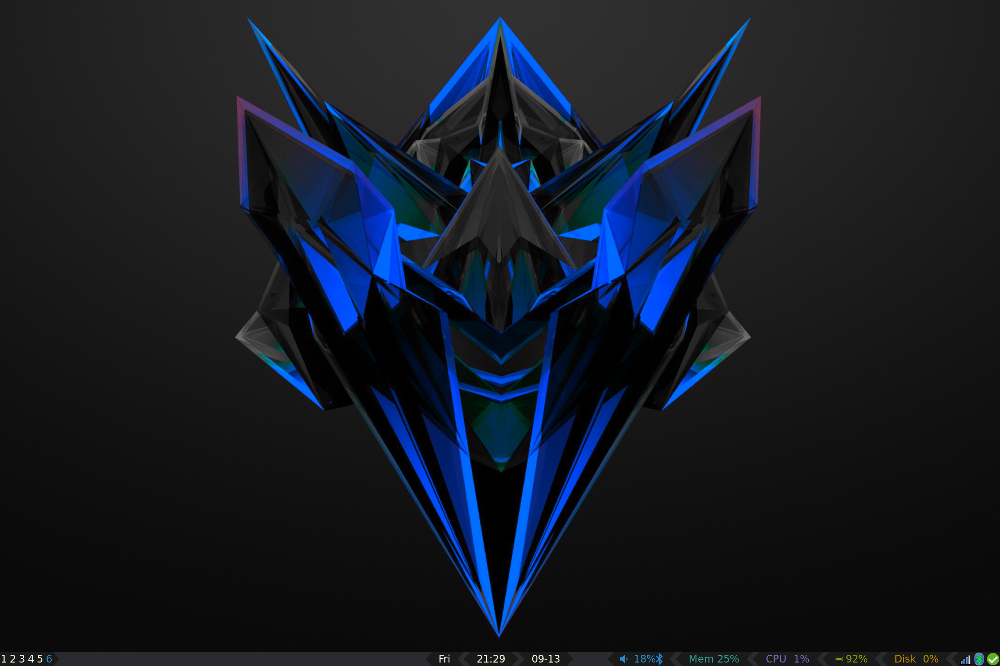
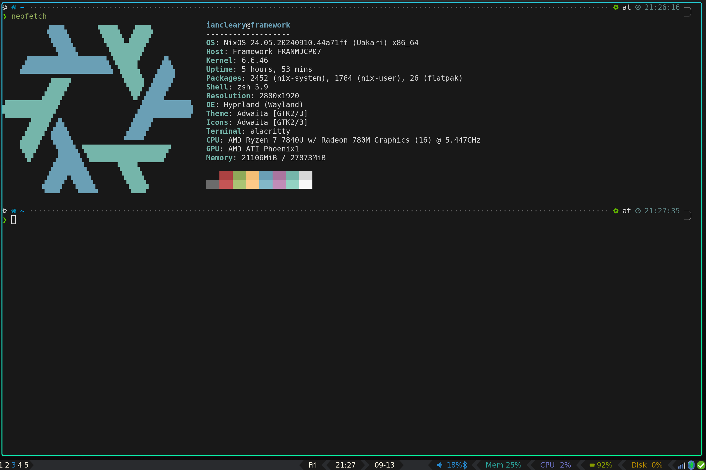

# My NixOS configuration for my desktop and laptop computers, with Nix Flakes

[](https://neovim.io)
[](https://nixos.org)

### Installation

First make sure, your user is in the sudo/wheel group.

```bash

# Clone this repository
git clone git@github.com:iancleary/nixos-config.git
cd nixos-config

# Open tempoary shell with nix and home-manager (shell.nix)
# if no flake.lock exists, run `nix flake update`
nix-shell

# Install the configuration (adjust #framework to your #yourhostname )
## Boot is used here so you don't mess up your current session
## This is useful when switching desktop environments or display managers
sudo nixos-rebuild boot --flake .#framework


# Exit temporary shell
exit
```

> Make sure to update the flake.nix and nixos/<hostname> folders for your hostname

### Update

```bash
# Go to the repo directory
nix flake update
sudo nixos-rebuild switch --flake .
```

### Desktop

Super + r to launch runner



Neofetch in kitty (Super + q)



### Useful Commands

#### Check battery health

```bash
nix-shell -p acpi                                                                                                                                                                                                                                  ─╯
acpi -i                                                                                                                                                                                                                                            ─╯
```

> which outputs something like
> ```bash
> Battery 0: Discharging, 84%, 04:47:22 remaining
> Battery 0: design capacity 3572 mAh, last full capacity 3152 mAh = 88%
> ```
> which is for a few year old [Framework 13's 55 Wh battery](https://frame.work/products/battery?v=FRANBBAT01).
## Resources

- [Nix config template](https://github.com/Misterio77/nix-starter-configs)
- [hlissner dotfiles](https://github.com/hlissner/dotfiles)
- [adfaure nix configuration](https://github.com/adfaure/nix_configuration)
- [Home-manager docs](https://nix-community.github.io/home-manager/index.html#ch-nix-flakes)
- [Building NixOS ISO](https://ash64.eu/2022/03/08/custom-nixos-isos/)
- [NixOS manual](https://nixos.org/manual/nix/stable)
- [NixOS Configuration - Folder Structure This Repo was based on](https://github.com/LongerHV/nixos-configuration/tree/3d9baf05bc1bc34e2b9137a475db123e84b7aec5)

